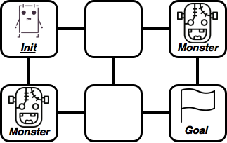
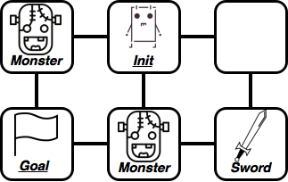
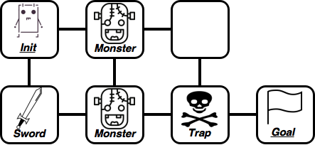

# PDDL Formalization (RPG Domain)
:beginner: Classical Planning Assignment

**Felipe Meneguzzi**  
**Mauricio Magnaguagno (PhD Student)**  
**Ramon Fraga Pereira (PhD Student)**

Assigned: 24 March
Due: Wednesday 31 March, 9h45am (final deadline Friday 2, with discounts)

Domain adapted from the [2016 The Fifth International Competition on Knowledge Engineering for Planning and Scheduling (ICKEPS)](https://helios.hud.ac.uk/scommv/ICKEPS/Scenarios.pdf), credits to [Dr. Lukas Chrpa](https://helios.hud.ac.uk/scomlc/) for the scenario.

## RPG Domain

You must work on this project **individually**. 
You are free to discuss high-level design issues with the people in your class, but every aspect of your actual formalisation must be entirely your own work.
Furthermore, there can be no textual similarities in the reports generated by each group. 
Plagiarism, no matter the degree, will result in forfeiture of the entire grade of this assignment.

For this assignment you will be using one of the web-based IDEs for PDDL we recommend, either [Planning Domains](http://editor.planning.domains), or [Web Planner](http://web-planner.herokuapp.com). 
You are free to use any of the implementations listed [below](#other-planning-software) as well for your local experiments.
Your deliverables must be handed in via Moodle using the correspondingly named upload rooms. 
At the end of this assignment, you will upload **one zip file** containing the problem specification files in the PDDL format, specifically:

-   one file named `rpg.pddl` containing the domain encoding;

-   three files containing the problems you formalised, named
    `pb#`, where `#` is the sequential number of your
    problem, e.g. `pb1.pddl`, `pb2.pddl`, and `pb3.pddl`;

-   the same number of files (with similar names) showing the traces (including the resulting plans) created by the planner for the problems you created (e.g. `pb1.pddl` and `pb1.txt`); and

-   one report following the guidelines detailed below.

## Overview

In this assignment you will formalise *RPG* to help a hero to get out of a dungeon. 
The hero woke up in a dungeon full of monsters and traps (perhaps the party last night went wrong...) and needs your help to get out. 
Here are basic facts about the dungeon:

- The dungeon contains rooms that are connected by corridors (the dungeon can thus be represented by an undirected graph);
- Each room can either be empty, have a monster, a trap in it, or a sword in it (this is an exclusive or, so only one object per room); and
- One of the empty rooms is the “goal”: it has an exit, so the hero can escape;

The hero is lucky, since he has full knowledge about the dungeon's layout.  
He is not that lucky, though, because just after the hero leaves room s/he just visited, the room is destroyed and cannot be visited again. 

The hero can perform the following actions, but only if s/he is alive!

- The hero can move to an adjacent room (connected by a corridor) that has not been destroyed (i.e., the hero has not yet visited the room);
- The hero can Pickup the sword if it is present in the room the hero is currently in and the hero is empty handed;
- S/He can also destroy the sword the hero currently holds. However, this can have unpleasant effects if done in a room with a trap or a monster;
- Finally, the hero can disarm a trap, if there is a trap in the room the hero is in and the hero is empty-handed (does not hold a sword), then the hero can disarm it.

However, there are some (dangerous) constraints the hero has to consider:
- If the hero enters a room with a monster in it, s/he has to carry a sword (so the monster is afraid of him/her), otherwise the monster kills him/her. Notice that the hero is a pacifist, so s/he cannot kill the monster;
- If the hero destroys the sword in a room with a monster in it, the monster kills him/her as well;
- The only action the hero can safely perform in a room with a trap in it is the “disarm a trap” action. Any other action (even moving away) triggers the trap, which kills the hero.

Whenever we need to use automated tools to solve problems on our behalf, we must provide a consistent specification of the *transition system* of the underlying problem. 
If we specify the problem poorly, we jeopardise the planner software ability to generate valid responses, leading to false negatives and unnecessarily long waiting times for the planner at best, or incorrect plans at worse. 
Thus, specifying the RPG domain in PDDL gives you a chance to develop your skills in designing consistent transition systems, helping you avoid bugs in the software you will write in the future to handle all kinds of other processes.

Your assignment is to develop a domain file from the specification above, and then model the situations depicted in the images below as individual problem files.

## Problem Instances

The image below represents the problem instances that you need to model in PDDL, once you are done encoding your domain file. 
The text that accompanies each image is self-explanatory; remember, you must model corridors between rooms, rooms for the hero to move through, and you can only move between connected rooms and visit each room only **once**. 
We specify problems so that cells stand for rooms and edges between them represent corridors. 
“Init” is the hero's initial position, “Goal” is hero's desired goal position, “Sword” indicates a sword, “Monster” is a monster, and “Trap” stands for trap. 

### Problem 1


---

### Problem 2

--

### Problem 3


## Grading (submission instructions)

In order to properly evaluate your work and thought process, you will write a short ```README.md``` file explaining your encoding and experiments. 
The report must have the following sections:

-   An introduction with your understanding of the problem domain, outlining the remainder of the paper;
-   Two domain formalisation sections explaining your approach to formalising the problems from Section [Problem Instances](#problem-instances).
-   One experimentation section where you measure the performance of the planner using your action formalisation for each of the domains, on multiple problems.
-   One conclusion section, where you will summarise your experience in encoding planning domains and discuss the performance of the planner, and any limitations encountered in solving the problems you encoded.

<!-- Grading will consider elements of your encoding, experimentation and reporting of the work done.
The criteria, as well as their weight in the final grade is as follows:

-   PDDL Encoding (50%) — correctness of the domain and problem encoding. This includes domain specification from Section [Overview](#overview), and problem specifications, particularly the initial state specification, as missing predicates here will jeopardise the planner ability to solve your problem;
	- Domain and Problem 1 (15%);
	- Domain and Problems 1 and 2 (30%); and
	- Domain and Problems 1, 2, and 3 (50%).

-   Overall report readability (20%) — how accessible and coherent your explanation of your encoding is;

-   Experiments (30%) — how coherent the proposed experiments are in measuring the performance of planner, notice that this criteria is complementary to the one regarding problem specification. You can also plot and compare the planning time of multiple planners. Furthermore, you must specify/modify other (more complex) planning problems (at least other 5 planning problems).

-   Bonus (10%) - formalise a domain and problem with at least 2 heroes. -->

## Sample PDDL files

We have provided two template PDDL files at [Domain Template](pddl/domain-template.pddl) and [Problem Template](pddl/problem-template.pddl) to get you started, these were obtained from the [myPDDL](https://github.com/Pold87/myPDDL "GitHub repository") sublime package.
We have also provided some sample files for other domains that you should look at before attempting to encode your own domain file and problem files.
These will give you an idea of the information that goes into each of those files, and the syntax.

<!-- Partly lifted from Nir's website -->
## Important Advice 

**Corrections:** From time to time, students or staff find errors (e.g., typos, unclear instructions, etc.) in the assignment specification. In that case, corrected version of this file will be produced, announced, and distributed for you to commit and push into your repository.  Because of that, you are NOT to modify this file in any way to avoid conflicts.

**Late submissions & extensions:** You have a 24 hour grace period with a penalty of 10% of the maximum mark, which increases to 50% until 48 hours after the due date, and 100% penalty thereafter. Extensions will only be permitted in _exceptional_ circumstances. 

**About this repo:** You must ALWAYS keep your fork **private** and **never share it** with anybody in or outside the course, except your teammates, _even after the course is completed_. You are not allowed to make another repository copy outside the provided GitHub Classroom without the written permission of the teaching staff. 

> **_Please do not distribute or post solutions to any of the projects._**

**Academic Dishonesty:** This is an advanced course, so we expect full professionalism and ethical conduct.  Plagiarism is a serious issue. Please **don't let us down and risk our trust**. The staff take academic misconduct very seriously. Sophisticated _plagiarism detection_ software will be used to check your code against other submissions in the class as well as resources available on the web for logical redundancy. These systems are really smart, so just do not risk it and keep professional. We trust you all to submit your own work only; please don't let us down. If you do, we will pursue the strongest consequences available to us..

<!-- **We are here to help!:** We are here to help you! But we don't know you need help unless you tell us. We expect reasonable effort from you side, but if you get stuck or have doubts, please seek help. We will ran labs to support these projects, so use them! While you have to be careful to not post spoilers in the forum, you can always ask general questions about the techniques that are required to solve the projects. If in doubt whether a questions is appropriate, post a Private post to the instructors. -->

**Silence Policy:** A silence policy will take effect **48 hours** before this assignment is due. This means that no question about this assignment will be answered, whether it is asked on the newsgroup, by email, or in person. Use the last 48 hours to wrap up and finish your project quietly as well as possible if you have not done so already. Remember it is not mandatory to do all perfect, try to cover as much as possible. By having some silence we reduce anxiety, last minute mistakes, and unreasonable expectations on others. 

Please remember to follow all the submission steps as per project specification.

## Miscellaneous Advice

Here are some lessons we learned in creating our own solution and writing papers/reports:

- [PDDL Reference](https://planning.wiki/ref)
-   As a first step, you should at least look at the sample domain and problem files given at the beginning of this specification.
    Additionally, here is a link to [PDDL domain and problem files](http://icaps-conference.org/index.php/Main/Competitions) (for scenarios different from the one you need to model in this project), from past iterations of the International Planning Competition (IPC).
-   The best way to figure out how to model a domain and associated problems is to look at these examples. If you feel the need for documentation, here is a paper that talks about the complete PDDL specification, with BNF specification at the end (Appendix A): [PDDL 2.1 Specification](http://www.public.asu.edu/~ktalamad/tmp/files/pddl21specs.pdf)
-   Using type predicates increases memory usage and slows down the creation of ground atoms but speeds up the (dominant) time to solve the problem (PDDL, however, allows typing of parameters);
-   Tables and graphs are a useful tool to show runtime performance of software, take a loot at [GnuPlot](http://www.gnuplot.info/ "GnuPlot is an excellent (and free) graph making software");
-   In order to evaluate the performance of a planning encoding, you need to specify problems with most of the parameters locked in, and measure runtime as one parameter increases (e.g. number of locations, number of containers, etc);
-   Pasting your entire domain specification (or problems) into the paper does not count as content (now you cannot say you were not warned);
-   Overly large figures used to simply fill space in the report are also not a good idea;
-   Reviewers have a more pleasant reading experience when papers are generated using <span style="font-variant:small-caps;">LaTeX</span>, it is very easy to spot the difference.
-   [JavaGP] does not parse “or” conditions or effects. You need to specify conditions / effects as a list of predicates bound together by a single “and”.
- [Nir Lipovetzky](http://nirlipo.github.io) runs a similar modelling problem in his planning course, except his also includes a visualization generated by [planimation](https://nirlipo.github.io/project/planimation/), [check it out](https://github.com/nirlipo/PDDLmodeling/tree/main/RPG-game)


### Most common requirements
- ``:strips`` - default requirement (positive preconditions, add and delete effects)
- ``:negative-preconditions`` - able to use ``not`` in preconditions
- ``:equality`` - able to use ``=`` in preconditions
- ``:typing`` - able to type objects and variables, ``obj - type``
- ``:disjunctive-preconditions`` - able to use ``or`` in preconditions
- ``:conditional-effects`` - able to use ``when`` in effects

### Downgrading PDDL
- Some planners may lack the desired requirements
- Sometimes we can rewrite the description using simpler constructions
- ``:negative-preconditions``
  - Duplicate predicate and use antonym instead, sometimes you can remove the original predicate
    - ``(not (clean ?space))`` => ``(dirty ?space)``
- ``:equality``
  - Add an equality predicate ``(equal obj obj)`` for each object at the initial state and replace preconditions
- ``:typing``
  - Move types to initial state and parameters to preconditions
    - ``(?var - type)`` => ``(type ?var)``
- ``:disjunctive-preconditions``
  - Break each part of the precondition into different actions

### What is important to describe?
- Which requirements you used?
  - Why?
  - Do they make it simpler to describe/understand the problem?
- Which predicates you used?
- Small modifications impact your description?
  - Typing
  - More than one hero
  - Get out dungeon with sword
  - Get out dungeon disarming all traps

## Other Planning Software

- [VSCode Plugin](https://github.com/jan-dolejsi/vscode-pddl), is a plugin for the popular VSCode IDE, which. This plugin requires:
   - [VSCode](https://code.visualstudio.com)
   - [PDDL Plugin](https://marketplace.visualstudio.com/items?itemName=jan-dolejsi.pddl)

[](http://www.youtube.com/watch?v=XW0z8Oik6G8 "")

- [Fast Downward](http://www.fast-downward.org)

- [JavaFF](https://github.com/Optimised/JavaFF)
  - Local planner, port of FF (C to Java)
  - Installation steps
    - Download and unpack zip
    - Check if java and javac are available in your path (JDK)
    - ``cd JavaFF/src``
    - ``javac javaff/*.java``
  - Write domain and problem in separate files and use their path as arguments
    - ``java javaff/JavaFF ../problems/depots/domain.pddl ../problems/depots/pfile01``

- [JavaGP](https://github.com/pucrs-automated-planning/javagp)
  - Local planner

- [Planning Domains](http://editor.planning.domains/#)
  - Online planner, editor and planning API
  - Write both domain and problem in the editor
    - New files can be created from the **File** top menu
    - Files are listed in the left, double click to rename
  - Click **Solve** in the top menu
    - Select domain and problem files before clicking **Plan**
    - Bottom right corner will display information about planning
    - Output file is generated, contain plan or error message

- [STRIPS-Fiddle](https://stripsfiddle.herokuapp.com/)
  - Online planner and editor
  - Write both domain and problem in the code editors
  - Click **Run** in the top menu
 
- [Web-planner](http://web-planner.herokuapp.com/) - This is the online planner we are developing and would like you to test
  - online planner, editor and visualizer.
  - The editor supports syntax highlighting for PDDL and shows both domain (left) and problem (center) at the same time.
  - The solve button calls the planner and shows the output (right).
  - The planner supports the following requirements:
    - ``:strips`` as the basic requirement for preconditions and effects
    - ``:negative-preconditions`` to use not in preconditions
    - ``:equality`` to use ``=`` in preconditions
    - ``:typing`` to define type of objects and parameters, ``?var - typeofvar``

